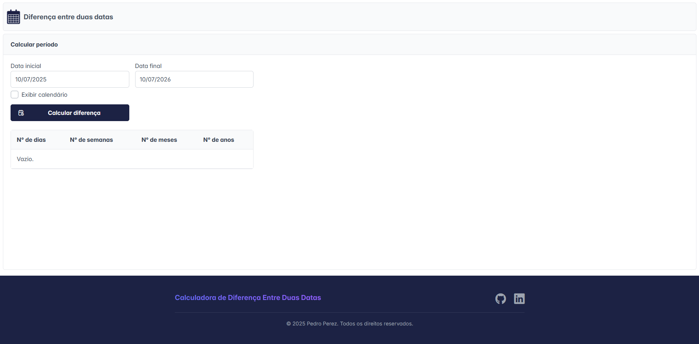
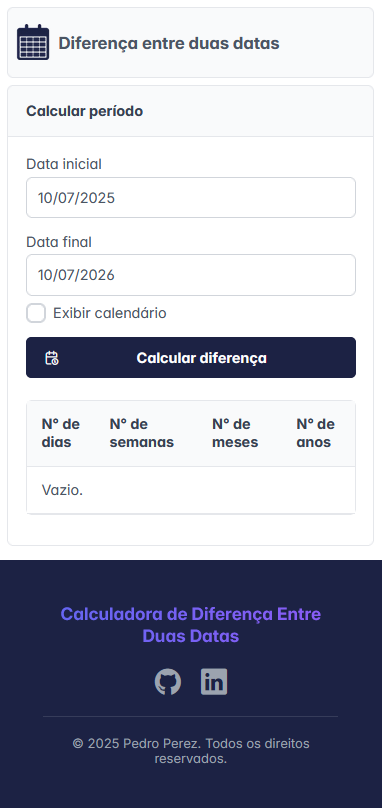

# Diferença entre duas datas
Aplicação front-end simples que permite calcular a diferença em dias entre duas datas distintas. 

## 📈 Tecnologias Utilizadas
- NextJS
- PrimeReact
- Jest
- TypeScript
- CSS

## 🔧 Instalação
- Antes de rodar a aplicação, cerifique-se de ter o NodeJS instalado em sua máquina: https://nodejs.org/pt/download.
- Clone o repositório
  ```
  git clone https://github.com/Pedr0Perez/diferenca-entre-datas
  cd diferenca-entre-datas
  ```
- Instale as dependências
  ```
  npm i
  ```  
- Rode a aplicação
  ```
  npm run dev
  ```

## 🧪 Testes Unitários
- Foram desenvolvidos testes unitários visando garantir a estabilidade dos componentes de layout da aplicação e das funções responsáveis pela conversão entre diferentes formatos de data.
- Rode os testes
  ```
  npm run test
  ```
- Para visualizar os testes, acesse o diretório: `diferenca-entre-datas/src/tests`

## 📘 Funcionalidades
- Escreva uma data no campo "Data inicial"
- Escreva uma data no campo "Data final"
- Clique no botão "Calcular diferença" para visualizar a diferença entre as duas datas. Atualmente, a diferença entre as datas é exibida em dias, semanas, meses e anos.

## 💻 Aplicação rodando em Desktop


## 💻 Aplicação rodando em Mobile

